## Plain Web Service for Tonality
This plain web service is a monolithic web application to stream your personal music collection. It's built using HTML, CSS, JavaScript, PHP, and MySQL.

## Prerequisites
- [Docker](https://docs.docker.com/get-docker/)

## Screenshots
1. Login Page
   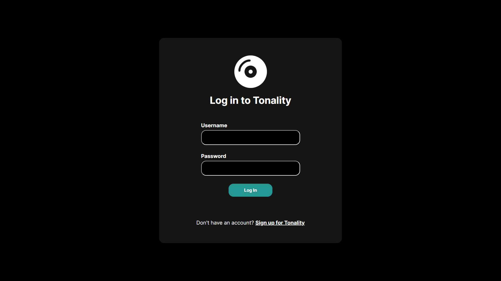

2. Register Page
   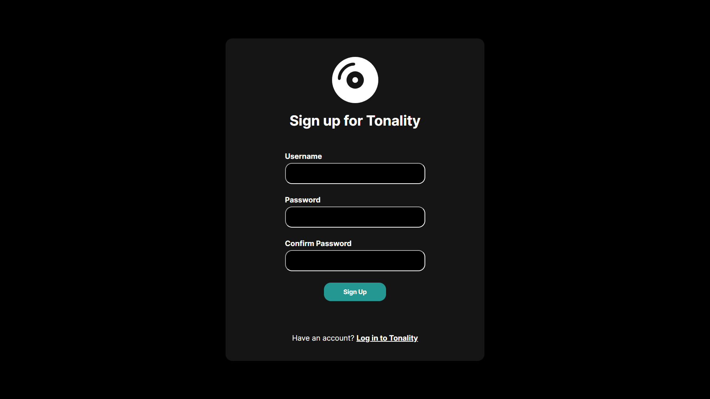

3. Add Playlist Page
   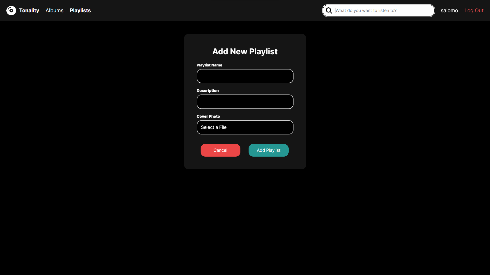

4. Add Song Page
   

5. Users Page
   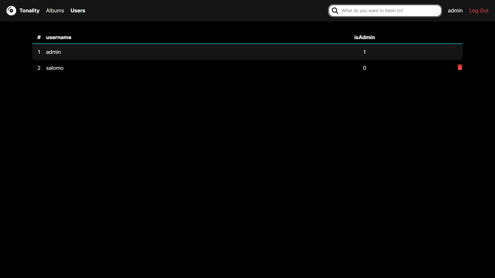

6. Add Song To Playlist Page
   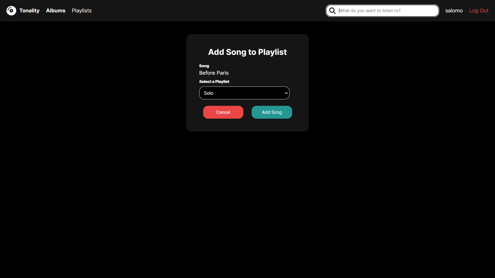

7. Album Content For Admin Page
   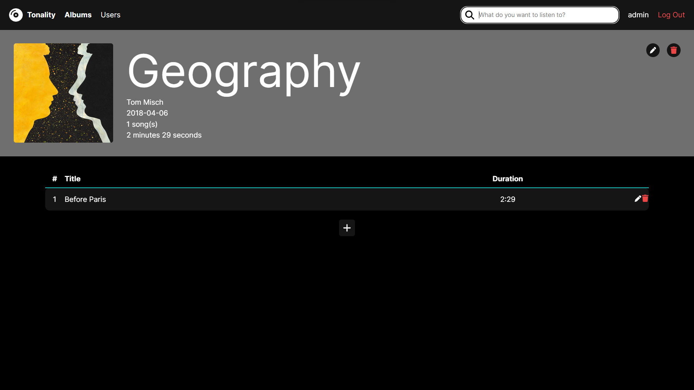

8. Album Content For User Page
   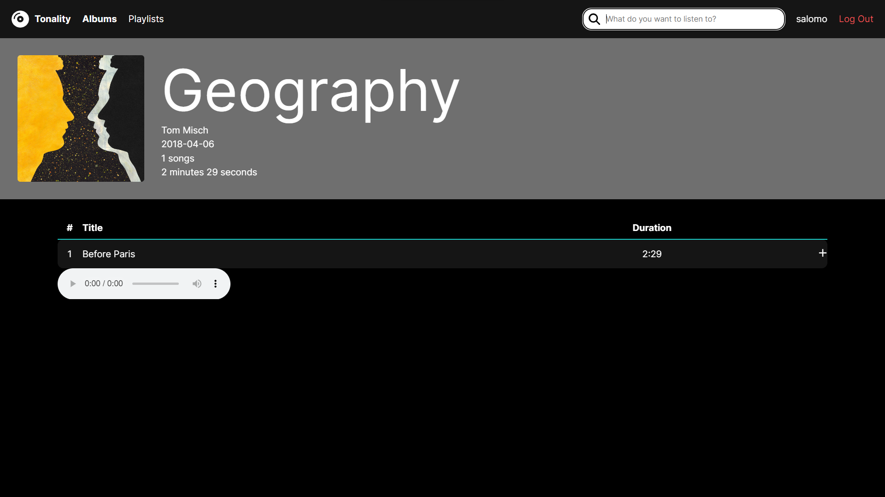

9. Delete Album Confirmation Page
   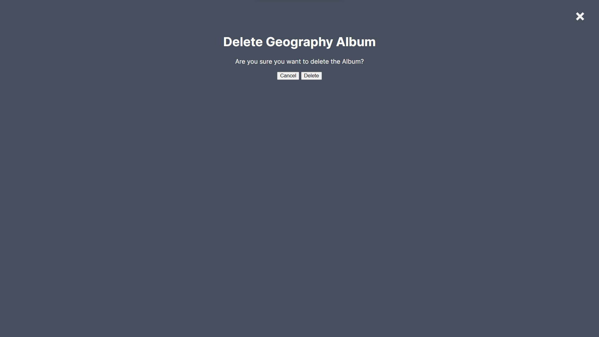

10. Albums For Admin Page
    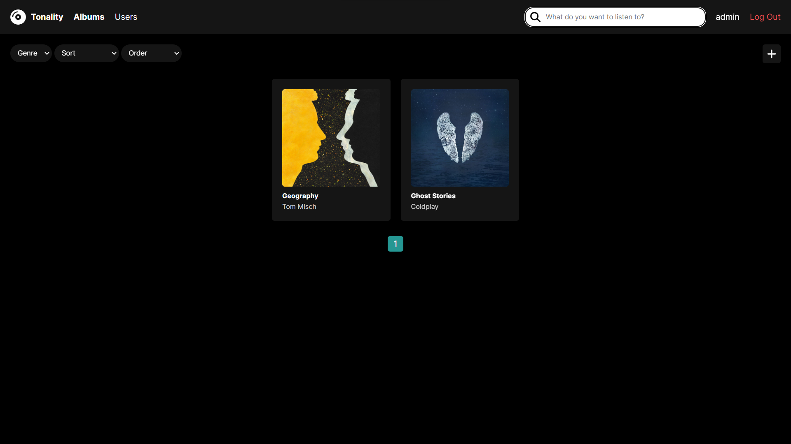

11. Album For User Page
    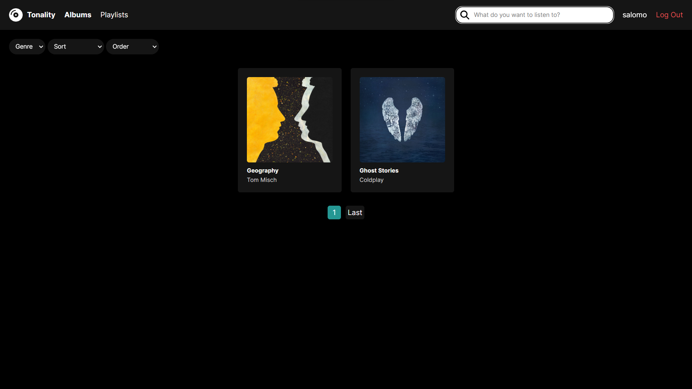

12. Delete Playlist Confirmation Page
    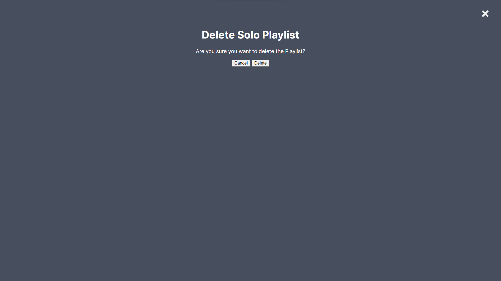

13. Delete Song From Playlist Confirmation Page
    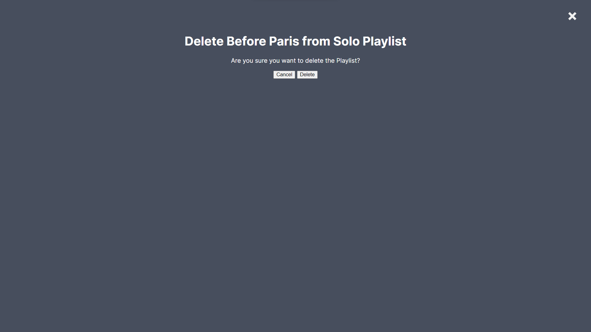

14. Update Album Page
    

15. Update Playlist Page
    

16. Update Song Page
    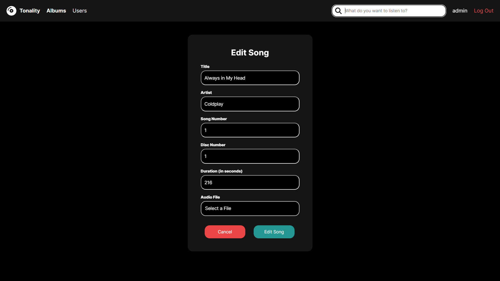

17. Playlist Content Page
    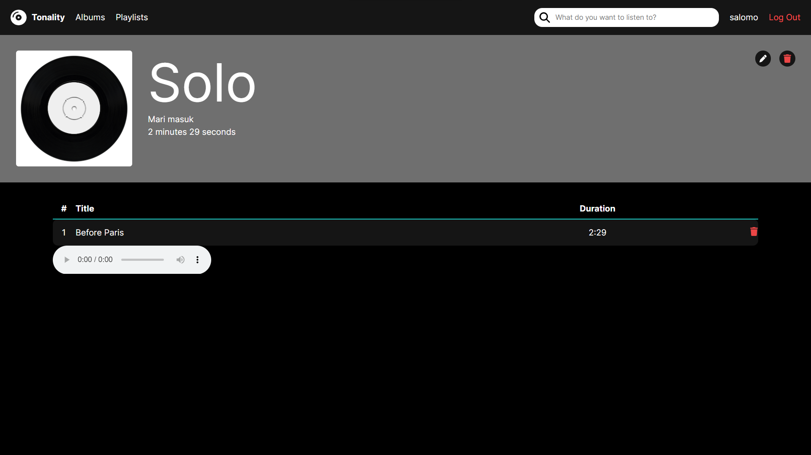

18. Playlist Page
    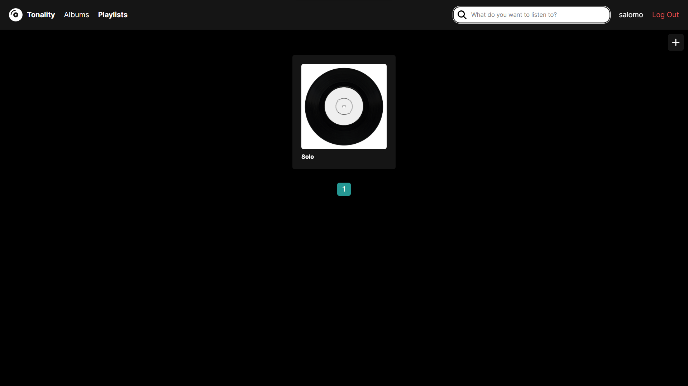

19. Delete Song From Album Confirmation Page
    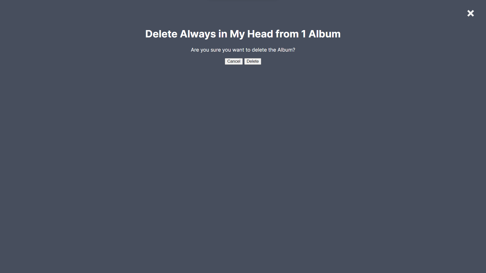

20. Update Album Page
    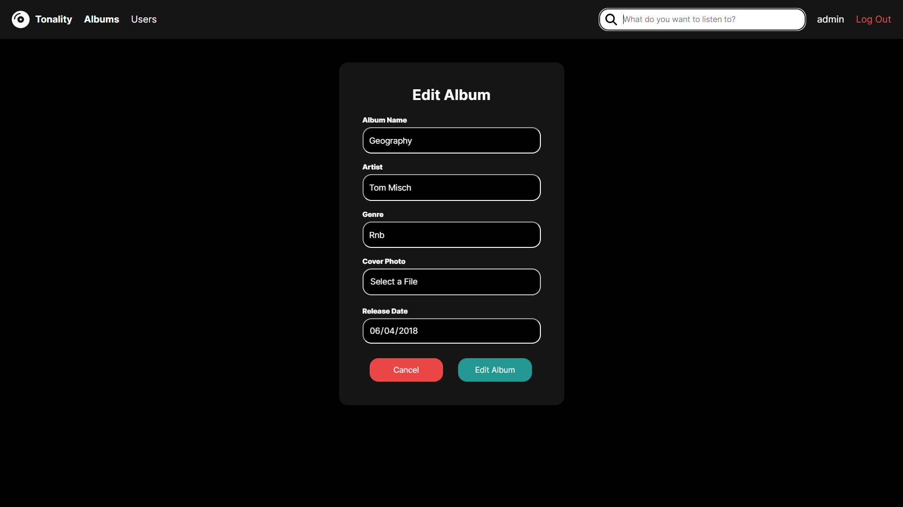

21. Delete User Confirmation Page
    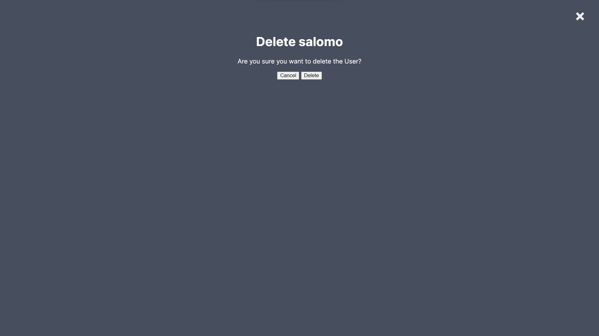

22. Add Album Page
    

## Task Distribution

### Team Members
| Student ID | GitHub                                          |
|------------|-------------------------------------------------|
| 13521063   | [Salomo309](https://github.com/Salomo309)       |
| 13521087   | [razzanYoni](https://github.com/razzanYoni)     |
| 13521096   | [noelsimbolon](https://github.com/noelsimbolon) |
| 10023329   | [taufik233](https://github.com/Taufiq233)       |

### Server Side
| Task                              | Student ID         |
|-----------------------------------|--------------------|
| User CRUD Operations and Auth     | 13521063, 13521087 |
| Delete Operations                 | 13521063, 13521087 |
| Searching, Filtering, and Sorting | 13521087           |
| Pagination                        | 13521087           |
| Create and Update Operations      | 13521096, 13521063 |
| Database                          | 13521096, 13521087 |
| Docker                            | 13521096           |

### Client Side
| Task                     | Student ID                   |
|--------------------------|------------------------------|
| Form                     | 13521063, 13521087, 13521096 |
| Navigation Bar           | 13521096, 13521063           |
| Album and Playlist Card  | 13521096                     |
| Filter and Sort Controls | 13521063, 13521096           |
| Table                    | 13521063                     |
| Audio Player             | 13521063                     |
| Pagination               | 13521087, 13521096           |
| AJAX                     | 13521087                     |

## Changes Made
- New subscription features